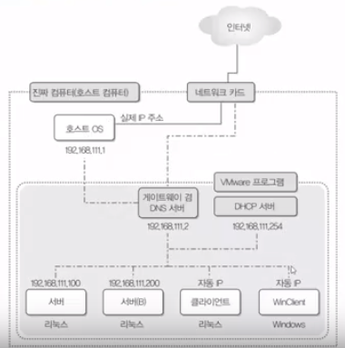

## 이것이 우분투 리눅스다

링크 

[이것이 우분투 리눅스다 링크](https://www.youtube.com/playlist?list=PLVsNizTWUw7H0hL3MIk4POxadZVwNOycL)

3장 4교시 윈도우 클라이언트 설치 까지 완료

 

### 1장 가상머신 4대 생성 및 네트워크 환경 설정

 

가상머신 툴 : VMware player 12(무료), VMware Workstation 12 PRO

#### 가상머신의 하드웨어 사양

|  | Server | Server(B) | Client | WinClient |
|--|:--:|:--:|:--:|:--:|-:|
| 주요 용도| 서버 전용 | 서버전용(텍스트 모드) | 클라이언트 전용 | Windows 클라이언트 전용 |
| 게스트 OS 종류 | Ubuntu-64bit | Ubuntu-64bit | Ubuntu-64bit | Windows 10 |
| 설치할 ISO | Ubuntu Desktop | Ubuntu Server | Ubuntu GNOME | Windows 10 평가판(32bit) |
| 네트워크 타입 | Use Network address translation (NAT) | Use Network address translation (NAT) | Use Network address translation (NAT) | Use Network address translation (NAT) |

가상머신의 장점

1. 1대의 컴퓨터만으로 실무환경과 거의 비슷한 네트워크 컴퓨터 환경 구성 가능
2. 하드웨어를 맘대로 장착하고 테스트할 수 있다.
3. 컴퓨터 상태를 그대로 저장하고 다음에 사용시 이어서 구동할 수 있다.

#### 호스트OS(가상머신을 돌리는 OS)에서 가상머신 네트워크 주소 확인

~~~
cmd
->
> ipconfig
...
이더넷 어댑터 ... ... VMnet8
    ...
    IPv4 주소 ... ... : 192.168.xxx.1
    ...
...
~~~

#### 강의영상과 같은 세팅으로 가상머신 네트워크 주소 변경

~~~
VMware Workstation -> Edit -> Virtual Network Editor -> Subnet IP 변경 -> 적용
~~~

#### 네트워크 환경 상세

### 3장 서버 및 클라이언트 설치

::: tip
위의 그림을 기반으로 네트워크 설정
:::

#### 서버

- 사용자계정 -> 자동로그인 키기

~~~
$ sudo su - root
# passwd
패스워드 설정
~~~

- 자동로그인시 로그인하는 유저 변경

~~~
# gedit /etc/lightdm/lightdm.conf
...
autologin-user=ubuntu -> root

# gedit /root/.profile
...
mesg n || true -> 주석처리
~~~

- 소프트웨어 업데이트 비활성화

~~~
시스템 설정 -> 소프트웨어 & 업데이트 -> 업데이트 탭에서 관련된 것들 모두 비활성화

> 업데이트된 버전을 받지 않고 원본버전만 설치하도록 설정
# cd /etc/apt
# mv sources.list sources.list.bak -> 파일명 변경
# wget http://download.hanbit.co.kr/ubuntu/16.04/sources.list
... 파일 다운로드 ...
# apt-get update
~~~

- 네트워크 설정 -> 192.168.111.100

~~~
# gedit /usr/lib/avahi/avahi-daemon-check-dns.sh
...
AVAHI-DAEMON-DETECT_LOCAL=1 -> 0
...

# gedit /etc/default/avahi-daemon
...
AVAHI-DAEMON-DETECT_LOCAL=1 -> 0
...
~~~

- vim설치 및 방화벽 활성화

~~~
# apt-get -y install vim
...
# ufw enable
~~~

- 나머지 화면보호기 및 한글설정 등은 적지 않겠..음

서버(B)

- 소프트웨어 자동 업데이트 비활성화 -> 위에 참조

- 네트워크 설정

~~~
$ cd /etc/network
$ sudo vi interfaces
...
iface ens32 inet dhcp
->
iface ens32 inet static
address 192.168.111.200 -> 고정 IP
netmask 255.255.255.0
network 192.168.111.0
broadcast 192.168.111.255
gateway 192.168.111.2
dns-nameservers 192.168.111.2
:wq
~~~

- 루트 사용자 허가 

~~~
$ sudo su - root
password:
# passwd
패스워드 설정
# reboot
~~~

클라이언트와 윈도우 클라이언트는 따로 설정하지 않아도 됨으로 생략.

