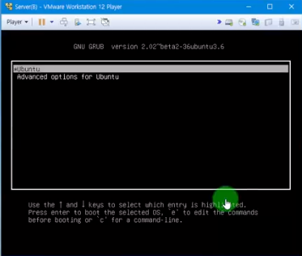
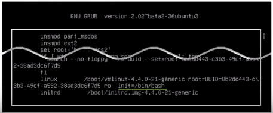

## 이것이 우분투 리눅스다

[유튜브 링크](https://www.youtube.com/playlist?list=PLVsNizTWUw7H0hL3MIk4POxadZVwNOycL)

4장 9교시 : 파이프, 필터, 리다이렉션, 응급복구

### 4장 필수 개념과 명령어

#### 파이프

- 두 개의 프로그램을 연결해 주는 연결통로
- '|' - 해당 기호로 파이프 표시

##### 실습

~~~
# ls -l /etc
.... 파일 및 디렉토리들 ...
// 해당 출력을 페이지단위로 보기! -> 파이프 이용
# ls -l /etc | more
... 페이지 단위로 출력, spacebar로 다음 페이지 이동
~~~

#### 필터

- 필요한 것만 걸러주는 명령어
- 주로 '파이프'를 이용

##### 실습

~~~
// 현재 컴퓨터에서 작동되는 프로세스 출력
# ps -ef
... 프로세스들 ...
// 'bash'키워드가 들어간 프로세스 출력
# ps -ef | grep bash
... 'bash' 키워드가 들어간 프로세스만 출력된다 ...
~~~

#### 리다이렉션

- 표준 입출력 방향을 바꿔줌
- 출력 내용을 파일로 저장할 때 씀

##### 실습

~~~
# ls -l > list.txt
.. 해당 명령에 대한 출력을 list.txt에 저장
// list.txt를 sort하고 sort한 내용 다시 저장
# sort < list.txt > out.txt
// 확인
# cat out.txt
... 완료
~~~

#### 프로세스(Process)

- 하드디스크에 저장된 프로그램이 메모리에 로딩되어 활성화된 것

  - 포어그라운드(Foreground) 프로세스 : 실행화면에 나타나 사용자와 상호작용하는 프로세스
    - 대부분의 응용프로그램
  - 백그라운드(background) 프로세스 : 실행은 되었지만, 화면에 나타나지 않고 실행되는 프로세스
    - 백신프로그램, 서버 데몬 등

- 부모 프로세스와 자식 프로세스
  - 모든 프로세스는 부모 프로세스를 가짐
  - 부모 프로세스를 kill하면 자식도 자동으로 kill

- 관련 명령어
  - ps : 현재 프로세스의 상태를 확인하는 명령
    - "ps -ef | grep <프로세스 이름>" 주로 사용
  - kill : 프로세스를 강제로 종료하는 명령어
    - "kill -9 <프로세스 번호>"는 강제종료
  - pstree : 프로세스를 부모, 자식 관계의 트리 형태로 보여줌

##### 실습 - Foreground 프로세스와 Background 프로세스의 상호 전환

~~~
*** 프로세스 종료 ***
// 아무것도 출력하지 않는 포어그라운드 프로세스
# yes > /dev/null

// ** 새 터미널을 열고 ** 프로세스 확인
# ps -ef | grep yes
root    1774    1635    95  21:23   pts/18  00:00:12    yes
->
프로세스번호 : 1774
부모프로세스번호 : 1635

// kill로 프로세스 강제종료
# kill -9 1774
... 이전 터미널의 작업이 종료된 것 확인

// 부모프로세스를 강제종료하면..?
# kill -9 1635
... 터미널 자체가 닫히는 것을 확인

*** 포어그라운드 -> 백그라운드 -> 포어그라운드
# yes > /dev/null
// 해당 작업을 잠시 멈춤
<ctrl + z>
[1]+ 정지됨     yes > /dev/null

// 백그라운드로 전환
# bg
... 전환 완료

// 포어그라운드 전환 위한 작업번호 확인
# jobs
[1]+ 실행중 ...
// 작업번호 1을 포어그라운드 전환
# fg 1
... 전환 완료

*** 처음부터 백그라운드로 실행
# gedit &
... &을 붙이면 편집기도 켜지고 터미널도 사용가능하다.
~~~

#### 서비스

- 시스템과 독자적으로 구동되어 제공하는 프로세스
  - 웹서버, DB서버, FTP서버 등
- 실행 및 종료는 'systemctl start/stop/restart <서비스이름>'
  - 서비스 실행 스크립트 파일은 /lib/systemd/system 디렉토리에 '서비스이름.service'로 확인
- 부팅과 동시에 서비스 자동 실행여부 지정가능
  - systemctl list-unit-files 명령 실행시 현재 사용(enable)과 사용안함(disable) 확인가능
  - rcconf 명령으로 설정

#### 소켓

- 항상 가동되는 서비스와 다르게, 소켓은 외부에서 특정 서비스를 요청한 경우 systemd가 구동시킨다.
- 요청이 끝나면 소켓도 종료된다.
- 단점 : 서비스 요청할 때는 처음 연결되는 시간이 보통 서비스보다 약간 더 걸릴 수 있다.
- 장점 : 평소에 가동이 안되므로 메모리를 아낄 수 있다.

#### 응급복구

##### 실습

- root 비밀번호를 분실하였을 때
- 응급복구모드로 들어가 비밀번호 재설정

> 
> 부팅시 ESC를 누르면 
>
> 
>
> 'e'키 입력
>
> 
>
> 초록밑줄의 내용을 추가
>
> ctrl + x 로 부팅
>
> 자동으로 root 계정 로그인

~~~
# mount
... / 파티션이 읽기전용(ro)로 마운트되어 패스워드 설정 불가 -> 응급복구모드로 들어갈 시 읽기전용으로 마운트됨

// 읽기전용을 읽기쓰기로 다시 마운트
# mount -o remount,rw /

// 패스워드 변경
# passwd
... 새 패스워드 설정
... 변경 성공
~~~

- 해당 방법으로 들어갈 수 있다면 심각한 문제.
- 실제 컴퓨터 운용시 GRUB 편집 자체를 막도록한다.
- 보통은 GRUB에 비밀번호 설정 또는 CMOS를 걸어놓거나 한다.

