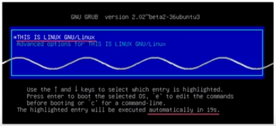
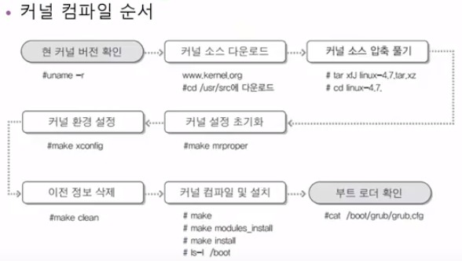

## 이것이 우분투 리눅스다

### 4장 10교시 GRUB 부트로더, 커널컴파일

#### GRUB 부트로더

앞서 GRUB 부트로더를 변경하는 법을 실습함.

- 특징
  - 부트 정보를 사용자가 임의로 변경해 부팅할 수 있다.
  - 다른 여러 가지 운영체제와 멀티부팅 가능.
  - 대화형 설정을 제공해 커널의 경로와 파일 이름만 알면 부팅이 가능하다.

- GRUB 설정방법
  - /boot/grub/grub.cfg 설정파일
    - 직접 변경 X
  - /etc/default/grub 파일과 /etc/grub.d/ 디렉터리의 파일을 수정한 후에 'grub-mkconfig' 명령어를 실행해 설정함.

##### 실습

- 부트로더 변경
- GRUB에 비밀번호 지정

~~~
Server(B)

// GRUB 부트로더 관련 설정파일 수정작업
# vi /etc/default/grub
...
// 부팅시간 및 변경
...
GRUB_TIMEOUT=2 -> 20
GRUB_DISTRIBUTOR="..." => "This is Linux"
...
:wq

// GRUB 부트로더 업데이트
# update-grub
...
# reboot
~~~

다음과 같이 부트로더가 변경되었다.

 

~~~
*** GRUB 부트로더에 비밀번호 설정
# vi /etc/grub.d/00_header
... 맨밑에서 추가 ...
cat << EOF
set superusers="grubuser"   // username
password grubuser 4321      // password
EOF
:wq

// GRUB 부트로더 업데이터
# update-grub
# reboot

// GRUB 편집시 username과 password 입력해야 가능
~~~

 

#### 모듈의 개념과 커널 컴파일

커널
- 리눅스의 엔진 역할
- 부팅시 항시 로딩되는 코드

모듈 
- 필요할 때마다 호출하여 사용되는 코드
- 커널이 커지는 것을 방지

 

##### 실습 - 커널 업그레이드

~~~
// 현재 커널 버전 확인 **
# uname -r
... 커널 버전

// kernel.org 사이트 이동 -> 커널 압축파일 다운로드 **
// 다운받은 압축파일이 있는 경로 이동
# cd 다운로드/
# ls -l
// 압축파일 이동
# mv  linux.4.9.6.tar.xz  /usr/src
# cd /usr/src

// 압축풀기 **
# tar  xfJ  linux.4.9.6.tar.xz
# cd linux.4.9.6

// 커널 설정 위한 관련 패키지 설치
# apt-get -y install qt5-default libssl-dev
... 다운받는중 ...

// 커널 설정 초기화 **
# make mrproper

// 커널 환경 설정 **
# make xconfig
... 커널 설정 프로그램 ...
-> 필요한 내용을 찾아 설정 추가/취소
--- 영상에서는 USB포맷인 NTFS 파일시스템 지원 추가
... 저장 후 닫기

// 이전 정보 삭제 **
# make clean

// 커널 컴파일 및 설치 **
# make : 커널 소스가 설정한 내용에 따라 컴파일 되는 것
# make modules_install
# make install
-> 3가지 작업을 명령 한 줄로 
# make; make modules_install; make install

~~~