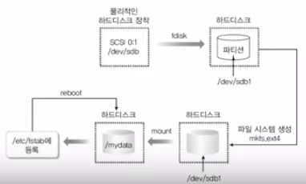

## 이것이 우분투 리눅스다

### 6장 1교시 - SATA/SCSI 장치 및 하드디스크 추가

#### SATA 장치와 SCSI 장치의 구성

- SCSI장치에 하드디스크 확인
  - VMware에서 Edit Virtual Machine 
  - 하드디스크 선택 후 Advanced...
  - node선택에 대한 dropbox의 리스트를 확인하면 어떠한 구성인지 파악가능
- 하드디스크를 물리적으로는 /dev/sda, /dev/sdb, /dev/sdc ... 형식으로 부름
  - 하드디스크가 추가될 경우 /dev/sd* 이 추가된다.
- 디스크 파티션이 나눠진 것을 논리적으로는 /dev/sda1, /dev/sda2, /dev/sda3, /dev/sdb1, /dev/sdb2 ... 형식으로 부름

- '/dev/sd*'은 하드디스크 자체(깡통), '/dev/sd*[n]'은 사용가능한 파티션들

#### 하드디스크 1개 추가

현재 서버 구성(하드디스크)
- 80GB SCSI 하드디스크
  - 파티션 1 : swap 4GB 
  - 파티션 2 : ext4 76GB

여기서 1GB 하드디스크를 추가하고, 1개의 파티션으로 구성한다고 하면
- 디스크 이름 : /dev/sdb
- 논리적 파티션 : /dev/sdb1
  - 파티션은 그냥 사용할 수 없으며 반드시 특정 디렉토리에 마운트시켜야 사용 가능

---

##### 실습 - 하드디스크 1개 추가

- 디스크 파티셔닝 관련 명령
  - fdisk : 디스크의 파티션을 나누는 명령
  - mkfs.ext4 : 파티션의 파일시스템을 ext4로 구성하는 명령
  - mount : 파티션을 특정 디렉토리에 마운트시키는 명령
- 부팅시 자동으로 읽히는 /etc/fstab 파일 편집

 

실습 흐름도

~~~
서버 부팅 전 하드디스크 추가
...
// 추가된 하드디스크 확인
# ls /dev/sd*
... 장치들 ...

// 연결된 하드디스크를 파티셔닝
# fdisk  /dev/sdb
...
Command (m for help):       // m을 통해 서브 명령어 확인
...
n   add new partition
...
Command (m for help): n     // 파티션 추가
... 파티션 타입 - p(Primary)
... 파티션 번호 - 선택
... First Sector(메모리 시작점) - <enter>(default)
... end Sector(메모리 끝점) - <enter>(default)
... 완료
Command (m for help): p     // 파티션 확인
... 파티션 정보
// 파티션 확인
# ls /dev/sd*
... /dev/sdb1 추가 확인

// 파일시스템 포맷
# mkfs.ext4  /dev/sdb1
... 포맷완료
// 마운트될 디렉토리 생성 및 파일생성
# mkdir /mydata
# touch /mydata/test1       // 해당 파일은 /dev/sda 하드에 들어있다.

// 파티션을 특정 디렉토리에 마운트
# mount  /dev/sdb1  /mydata

---------------------------- 하드디스크 1개 추가 끝

# ls /mydata
... 마운트 전에 생성한 test1 파일이 보이지 않음
-> 해당 디렉토리가 다른 디스크로 마운트되어 이전 파일(/mydata/test1)은 숨겨진다.
// 마운트 후 파일 생성
# touch /mydata/test2
# ls /mydata
test2
// 마운트 해제하면 어떻게 될까?
# umount  /dev/sdb1     // 장치만 적어줘도 됨
# ls /mydata
test1       // 마운트 전에 생성한 파일이 보임.
-> 마운트가 되면 논리적으로는 이전 파일이 없어지지만 
물리적으로는 남아있어 마운트 해제시 파일이 보이는 것을 알 수 있음.
~~~

~~~
// 재부팅시에도 마운트 적용
# gedit /etc/fstab
..... 맨끝
/dev/sdb1   /mydata     ext4    defaults    0   0       // 틀리면 안됨
-> 순서대로
파티션  마운트할 디렉토리   파일시스템      모름    모름    모름
: 마지막 2개는 부팅시 디스크 검사..? 만약 1로 놓으면 부팅시 느려짐.
// 재부팅 후 자동 마운트 확인
# mount
~~~