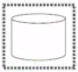
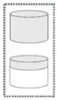
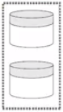
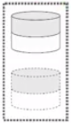
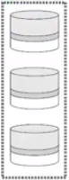
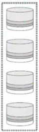
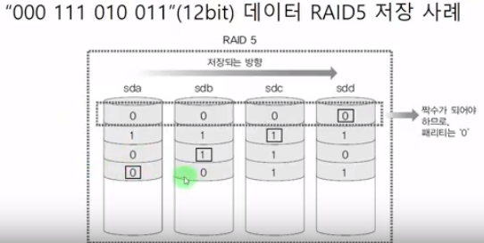
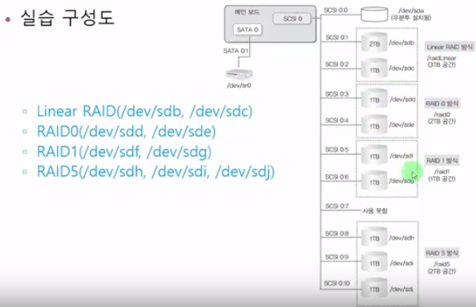
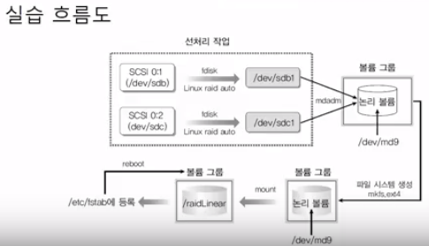

[[toc]]

## 이것이 우분투 리눅스다

### 6장 2교시 RAID의 개념, 하드디스크 9개 준비

#### RAID

- Redundant Array of Inexpensive Disks
- 여러 개의 디스크를 하나의 디스크처럼 사용
- 비용 절감 + 신뢰성 향상 + 성능 향상
  - 하드웨어 RAID
    - 하드웨어 제조업체가 여러 개의 하드로 장비를 만들어 그 자체를 공급
    - 좀 더 안정적, 하지만 상당한 고가
  - 소프트웨어 RAID
    - 고가의 하드웨어 RAID 대안
    - 운영체제에서 지원하는 방식
    - 저렴한 비용으로 좀 더 안전한 데이터의 저장이 가능
    - 교재에서 진행하는 내용.

#### 각 RAID방식 비교

||단순 볼륨|Linear RAID|RAID0|RAID1|RAID5|RAID6|
|:--:|:--:|:--:|:--:|:--:|:--:|:--:|
|그림|||||||
|사용량 (각 디스크는 1T)|1T(N)|2T(N)|2T(N)|1T(N/2)|2T(N-1)|2T(N-2)|
||||Stripping|Mirroring|패리티 사용|중복 패리티 사용|
||단순 저장|1번째부터 차례로 저장|동시 저장|동시 저장|동시 저장|동시저장|
|||복구 불가|복구 불가|복구 가능|복구 가능(1개 손상시)|복구 가능 (2개 이하 손상시)|
|공간 효율||100%|100%|50%(나쁨)|N-1/N|N-2/N|

- 패리티를 이용한 데이터 복구
  - RAID5, RAID6은 패리티를 이용해 결함 허용됨

#### 실습

##### 9개의 하드디스크 추가 및 파티션 생성

~~~bash
// 실습 전 작업 : 실습 구성도에 따라 하드디스크 추가
... 부팅

//              추가한 하드디스크 확인
ls -l /dev/sd*
... /dev/sdb ~ /dev/sdj - 추가된 하드디스크 확인

//              하드디스크에 RAID타입의 파티션 생성
fdisk /dev/sdb ~ /dev/sdj
... 타입을 raid로 한다는 것에 주의
-> t(type) - fd(linux raid auto)
~~~

### 6장 3교시 Linear RAID, 0, 1, 5 구축

##### RAID 구축 (Linear, 0, 1, 5)

~~~bash
//              mdadm 명령을 사용하기 위한 설치
apt-get -y install mdadm
...

//              논리볼륨(Linear RAID) 만들기
mdadm  --create  /dev/md9  --level=linear  --raid-devices=2  /dev/sdb1  /dev/sdc1

//              만들어진 논리볼륨 확인
mdadm  --detail  /dev/md9
...

//              파일 시스템 생성
mkfs.ext4  /dev/md9

//              특정 디렉토리 마운트
mkdir  /raidLinear
mount  /dev/md9  /raidLinear

... 나머지 raid0, raid1, raid5도 같은 형식의 명령어 (옵션은 당연히 다르다)

//              재부팅 시에도 RAID볼륨이 마운트 되도록
gedit  /etc/fstab
... 밑에 다음과 같은 형식으로 추가
/dev/md9    /raidLinear     ext4    defaults    0   0
mdadm  --detail  --scan
... 다음 내용 복사 ...
gedit  /etc/mdadm/mdadm.conf
... 맨 밑에 복사 붙여놓기 - name=server:? 항목만 지우기 - 저장
update-initramfs -u       // 수정 내용 업데이트
reboot
~~~

다음 강의 도중 오류 발생 (계속 응급복구모드, 마운트도 안되있는 파티션은 자꾸 busy...)

결국 포기하고 다음 강의는 내일로.. 크흡ㅠ
