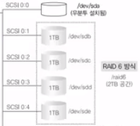
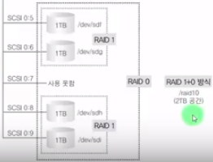
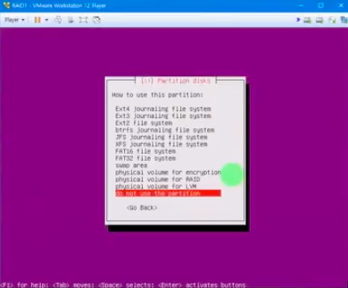
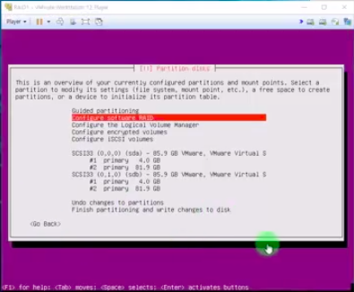
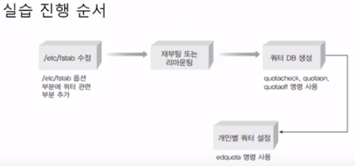

[[toc]]

## 이것이 우분투 리눅스다

### 6장 5교시 RAID6, 1+0 구현 및 문제발생에 대한 복구

#### RAID6 

- RAID5보다 신뢰도를 높임
- 패리티 데이터가 2개의 디스크에 저장됨
- 최소 4개의 디스크가 필요
- N-2의 디스크 공간 효율

#### RAID1+0

- 신뢰도와 속도 둘다 갖춤
- RAID1인 두 개의 파티션을 RAID0으로 만드는 개념
- 최소 4개의 디스크가 필요
- 50%의 디스크 공간 효율

#### 실습

- 스냅샷으로 초기화
- 8개의 하드디스크 필요(모두 1GB)

~~~bash
... 부팅
# 추가된 하드디스크 파티셔닝
fdisk </dev/sdb ~ /dev/sdi>
... n ... t: fd(raid) ...

# RAID6 만들기 
mdadm  --create  /dev/md6  --level=6  --raid-devices=4  /dev/sdb1  /dev/sdc1  /dev/sdd1  /dev/sde1
mdadm  --detail  /dev/md6
... RAID6 확인
mkfs.ext4  /dev/md6         // 파일시스템 포맷
mkdir  /raid6               // 마운트될 폴더 생성
mount  /dev/md6  /raid6     // 마운트

# RAID1+0 만들기
# RAID1 2개 만들고
mdadm  --create  /dev/md2  --level=1  --raid-devices=2  /dev/sdf1  /dev/sdg1
mdadm  --create  /dev/md3  --level=1  --raid-devices=2  /dev/sdh1  /dev/sdi1
# RAID1 2개로 RAID0을 만든다.
mdadm  --create  /dev/md10  --level=0  --raid-devices=2  /dev/md2  /dev/md3
mdadm  --detail  </dev/md2, /dev/md3, /dev/md10>
... RAID 생성 확인
mkfs.ext4  /dev/md10          // 파일시스템 포맷
mkdir  /raid10               // 마운트될 폴더 생성
mount  /dev/md10  /raid10     // 마운트

# 문제발생 및 복구
- 각 RAID마다 2개의 하드디스크 고장
- 고장 후 데이터 이상여부 확인
... 부팅 ...
응급복구모드 -> root비밀번호 입력 후 로그인
# RAID1+0, RAID6 복구 가능
# RAID6
mdadm  --run  /dev/md6
# RAID1+0
# RAID1에 해당하는 파티션만 살릴 수 있다.
mdadm  --run  /dev/md2
mdadm  --run  /dev/md3
# RAID0은 새 것을 생성
mdadm  --create  /dev/md10  --level=0  --raid-devices=2  /dev/md2  /dev/md3

# 확인
mdadm  --detail  /dev/md6   // 2개 고장
mdadm  --detail  /dev/md10  // 새로 만들어 멀쩡
mdadm  --detail  /dev/md2   // 1개 고장
mdadm  --detail  /dev/md3   // 1개 고장

# 고치고 다시 마운트 해야함
umount  /dev/md10
mdadm  --stop  /dev/md10
~~~

 

### 6장 6교시 LVM 개념과 구현

#### LVM

- Logical Volume Manage
- 여러개의 하드디스크를 합쳐서 한 개의 파일시스템으로 사용하는 것으로 필요에 따라 나눌 수 있다.(RAID와 차이점)
- ex) 2TB용량의 하드디스크 2개를 합친후 다시 1TB와 3TB로 나눠서 사용 가능
- 용어
  - Physical Volume(물리 볼륨) : 파티션
  - Volume Group(볼륨 그룹) : 여러 물리 볼륨을 하나의 물리 그룹으로 만든다.
  - Logical Volume(논리 볼륨) : 볼륨 그룹을 1개 이상으로 나눠 논리 그룹으로 나눈 것

#### 실습

- LVM 구현
- 명령어
  - pvcreate : 물리 볼륨으로 만든다.
  - vgcreate : 볼륨 그룹으로 만든다.
  - lvcreate : 논리 볼륨으로 만든다.

~~~bash
- 스냅샷 초기화
- 2개의 하드디스크 추가(2TB, 3TB)
... 부팅 ...
#               파티셔닝
fdisk  </dev/sdb, /dev/sdc>
... n ... t=8e(Linux LVM) ... w
#               LVM 관련 설치
apt-get -y install lvm2

# 물리 볼륨 만들기
pvcreate  /dev/sdb1
pvcreate  /dev/sdc1
# 볼륨 그룹 만들기
vgcreate  /dev/myVG  /dev/sdb1  /dev/sdc1
# 논리 볼륨으로 나누기(1T, 3T, 1T)(T -> G)
lvcreate  --size  1G  --name  myLG1  myVG
lvcreate  --size  1G  --name  myLG2  myVG
lvcreate  --extents  100%FREE  --name  myLG3  myVG
... 마지막 논리 볼륨은 그룹에서 남는 용량 전체를 차지

mkfs.ext4  </dev/myVG/myLG1, /dev/myVG/myLG2, /dev/myVG/myLG3>          // 파일시스템 포맷
mkdir  /lvm1 /lvm2 /lvm3    // 마운트 폴더 생성
// 마운트
mount  /dev/myVG/myLG1  /lvm1
mount  /dev/myVG/myLG2  /lvm2
mount  /dev/myVG/myLG3  /lvm3
gedit  /etc/fstab               // 재부팅시 마운트
~~~

### 6장 7교시 RAID에 우분투 설치

- OS(우분투)가 설치되어 있는 디스크가 고장나면 부팅조차 못하는 상황 발생
- RAID1 방식(Mirroring)으로 동시 설치 진행

#### 실습

- 새 가상머신(RAID1) 생성
- 80GB 하드디스크 2개 추가
  - OS는 우분투 서버로 진행(데스크톱 아님)
- 이전 Server(B) 설치와 동일하게 진행하다가 하드디스크 파티셔닝에서 옵션 추가

- 하드디스크 둘다 4G(swap) 76G(/) 파티셔닝
- 파티셔닝 중 모든 파티션 do not use

- 파티셔닝 모두 마치면 configuration software RAID

- Create MD devices -> RAID1 -> 장치갯수 2 -> 예비 0 -> 스왑끼리 '/' 끼리 (</dev/sda1, /dev/sdb1>, </dev/sda2, /dev/sdb2>)(spacebar: 선택)
- RAID 구현은 끝, Finish후 파일시스템 포맷
  - 4GB - swap
  - 76GB - ext4, '/'
- 설치진행....
...
~~~bash
# 확인
df
... 마운트 확인
mdadm  --detail  </dev/md/0, /dev/md/1>
... RAID 확인
~~~

- 디스크 1개 고장상황 실습
  - 고장 이전에 1개의 예비 디스크 추가(80GB)
  - /dev/sda의 파티션 구성을 /dev/sdc에 복사 가능

~~~bash
# /dev/sdc를 /dev/sda와 같은 파티션으로 구성
sudo  sfdisk  -d  /dev/sda  |  sudo  sfdisk  /dev/sdc
# 확인
sudo  fdisk  -l  /dev/sda  /dev/sdc
~~~

- 디스크 1개(SCSI0:0) 고장

~~~bash
... 부팅시도 ...
정상부팅불가
mdadm  --detail  --scan
INACTIVE-ARRAY ...
INACTIVE-ARRAY ...
-> RAID 비활성화 확인
# 강제 가동
mdadm  --run  /dev/md0
mdadm  --run  /dev/md1
# 확인
mdadm  --detail  /dev/md0
mdadm  --detail  /dev/md1
... 각 RAID device마다 1개의 디스크 고장 확인

# 예비 디스크를 RAID에 추가
mdadm  /dev/md0  --add  /dev/sdb1  (swap)
mdadm  /dev/md1  --add  /dev/sdb2  ( '/' )
... ...
mdadm  --detail  /dev/md0
mdadm  --detail  /dev/md1
... 정상적 상태 확인!!! ...
reboot
~~~

### 6장 8교시 쿼터

#### 쿼터

- 파일시스테맘다 사용자나 그룹이 생성할 수 있는 파일의 용량 및 개수를 제한하는 것
- 별도의 파일시스템을 지정해 해당 부분을 쓰도록 하는 것이 좋음
  - "/" 파일시스템에 대해 사용자를 많이 두게되면, 서버 운영작업과 일반 사용자의 작업이 동시에 발생해 전반적인 시스템 성능이 저하됨

#### 실습

- 사용자를 만들고, 해당 사용자에게 공간 할당
- 쿼터의 설정 및 작동에 대한 이해

- 사용자용 디스크(10GB) 추가
- 파티셔닝 및 마운트

~~~bash
# 파티셔닝 및 마운트
fdisk  /dev/sdb
... n ... w
mkfs.ext4  /dev/sdb1
mkdir  /userHome
mount  /dev/sdb1  /userHome

# 사용자 추가 및 홈디렉토리 설정
adduser  --home  /userHome/john  john
... ...
adduser  --home  /userHome/bann  bann
... ...
~~~

그 다음..

~~~bash
# 1. /dev/sdb1을 쿼터용으로 지정(/etc/fstab에 쿼터 관련 부분 추가)
gedit  /etc/fstab
... ... 마지막 줄
/dev/sdb1   /userHome   ext4    defaults,usrjquota=aquota.user,jqfmt=vfsv0  0   0
... 저장

# 2. 재부팅 또는 리마운팅
mount  --options  remount  /userHome

# 3. 쿼터 DB 생성
## 쿼터 관련 패키지 설치
apt-get  -y  install  quota
## 쿼터 지정
cd /userHome
quotaoff  -avug
quotacheck  -augmn
rm  -f  aquota.*
quotacheck  -augmn
touch  aquota.user  aquota.group
chmod  600  aquota.*
quotacheck  -augmn
quotaon  -avug
... 쿼터 실행 완료

# 4. 개인별 쿼터 설정
edquota  -u  john
... 사용자 john에 대한 쿼터 설정
filesystem  blocks  soft    hard    inodes  soft    hard
/dev/sdb1       28  10240   15360   5       0       0
- blocks와 inodes
  - blocks: 사용자의 용량을 제한할 때
  - inodes: 사용자의 파일 갯수를 제한할 때
    + soft: soft제한량 : 경고가 나오는 크기
    + hard: soft제한량 : 넘어가지 못하는 제한점
-> 용량이 10240가 넘으면 경고, 15360가 넘으면 에러
ctrl + o (저장) -> enter -> ctrl + x(나가기)

# 쿼터 용량을 넘겨본다면?
cd
su - john
cp  /boot/vm*  test1    // 복사하는 파일은 약 7MB 정도 크기
cp  /boot/vm*  test2
cp  /boot/vm*  test3
... 디스크 할당량 초과!
ls -l
... 할당량 초과로 에러가 났지만 test1 ~ test3파일까지 복사된 것으로 보인다. 그러나 test3는 파일 전체를 온전히 복사하지 못한 상태이다.
# 사용자 자신의 쿼터 확인
quota
... 사용 중인 용량 및 제한용량 확인

exit -> root로 빠져나와
repquota  /userHome
... 해당 쿼터 설정 확인
# john의 쿼터를 bann에게도 같은 쿼터로 설정(쿼터 설정 복사)
edquota  -p  john  bann
~~~
