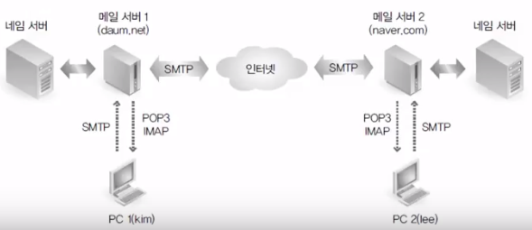
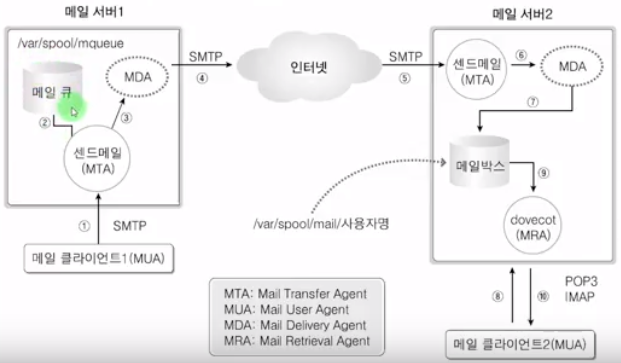
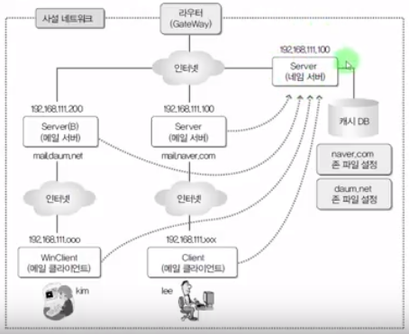

## 이것이 우분투 리눅스다

### 9장 4교시 라운드 로빈 방식(Round Robin) 네임서버

#### 라운드 로빈 방식

 여러 대의 웹서버를 운영해서, 웹 클라이언트가 서비스를 요청할 경우에 교대로 서비스를 제공하도록 하는 방식

#### 실습

- www.john.com으로 서비스 요청시 외부 사이트 3개의 IP로 라운드 로빈 수행
  - `www.yes24.com`
  - `www.danawa.com`
  - `www.nate.com`

~~~bash
# 9장 3교시에 이어서
nslookup
> www.yes24.com
... www.yes24.com의 IP주소
> www.danawa.com
... www.danawa.com의 IP주소
> www.nate.com
... www.nate.com의 IP주소

cd /etc/bind
vi john.com.db
...
www     IN  CNAME   webserver.john.com
... 맨밑
webserver   100 IN  A   <yes24 IP>
            200 IN  A   <danawa IP>
            300 IN  A   <nate IP>
:wq

# 오류 체크
named-checkzone john.com john.com.db

# 네임서버 재시작
systemctl restart bind9

# 적용됬는지 확인
nslookup
> server 192.168.111.100
...
> www.john.com
... 할당한 3개의 IP가 있는 것을 확인!
~~~

---

### 10장 1교시 메일서버 개념, 메일서버를 위한 네임서버 구축

#### 이메일의 송수신에서 사용되는 프로토콜

- SMTP(Simple Mail Transfer Protocol) : 클라이언트가 메일을 보내거나, 메일 서버끼리 메일을 주고 받을 때
- POP3(Post Office Protocol), IMAP(Internet Mail Access Protocol) : 메일서버에 도착되어 있는 메일을 가져올때

#### 작동원리(센드메일) 그림

#### 실습 : 메일서버를 위한 네임서버 구축

- 도메인 구성
  - Server : mail.naver.com라는 도메인
  - Server(B) : mail.daum.net이라는 도메인
  - Client(Linux) : `mail.naver.com` 메일서버의 클라이언트
  - WinClient(Window) : `mail.daum.net` 메일서버의 클라이언트
- 

~~~bash
# 네임서버 구축 전 sendmail 패키지 설치 및 자신에게 자기 도메인 등록

## Server
## 센드메일 패키지 설치
apt-get  -y  install  sendmail
...

## hostname 변경
vi /etc/hostname
1 server -> mail.naver.com
:wq

## mail.naver.com을 hosts에 등록
vi /etc/hosts
...
3 
+ 192.168.111.100   mail.naver.com
...
:wq

## mail.naver.com을 sendmail의 로컬설정 변경
vi /etc/mail/local-host-names
... 맨밑
+ mail.naver.com
:wq

## 적용시키기 위해 재부팅
reboot

## Server(B) -> *** 위와 동일하게 ***
... ... ... ...
... ...

# 네임서버 구축
## 패키지 설치
apt-get  -y  install bind9 bind9utils

## 네임서버 구축관련 설정들
vi  /etc/bind/named.conf.options
...
3
+   recursion  yes;
+   allow-query  {  any;  };
:wq

## 네임서버 구축관련 설정들 - 캐시db 지정
vi  /etc/bind/named.conf
... 맨밑
+ zone  "naver.com" IN  {
+   type master;
+   file "/etc/bind/naver.com.db"
+ };
+
+ zone  "daum.net" IN  {
+   type master;
+   file "/etc/bind/daum.net.db"
+ };
:wq

## 네임서버 구축관련 설정들 - 캐시db 구축
cd  /etc/bind
touch  naver.com.db  daum.net.db
vi  naver.com.db
+ $TTL  3H
+ @     IN  SOA     0   root.   ( 2 1D 1H 1W 1H )
+
+ @     IN  NS      0
+       IN  A       192.168.111.100
+       IN  MX      10      mail.naver.com
+
+ mail  IN  A       192.168.111.100
:wq

cp  -f  naver.com.db  daum.net.db
vi  daum.net.db
+ $TTL  3H
+ @     IN  SOA     0   root.   ( 2 1D 1H 1W 1H )
+
+ @     IN  NS      0
+       IN  A       192.168.111.200
+       IN  MX      10      mail.daum.net
+
+ mail  IN  A       192.168.111.200
:wq

## 문법상 이상없는지 확인
named-checkconf
named-checkzone  naver.com  naver.com.db
named-checkzone  daum.net  daum.net.db

## 네임서버 재시작
systemctl  restart  bind9
systemctl  enable  bind9

## 방화벽 포트 허용 ( 편하게 방화벽을 아예 꺼버림 )
ufw  disable

## 네임서버 확인
nslookup
> server 192.168.111.100
...
> mail.naver.com
... 응답성공
> mail.daum.net
... 응답성공

# 모든 가상머신에 192.168.111.100(Server)를 네임서버로 지정
## Linux
vi  /etc/NetworkManager/system-connections/유선\ 연결\ 1
...
[ipv4]
address1=...
dns=192.168.111.100     <- 변경
...
:wq
vi  /etc/resolv.conf
...
nameserver  192.168.111.100     <- 변경
...
:wq

## Windows
명령프롬프트
netsh  interface  ip  set  dns  Ethernet0  static  192.168.111.100

## 서버 응답 확인
nslookup    ->  Linux, Windows 모두 가능

~~~

---

### 10장 2교시 Sendmail 메일 서버 구축

#### 실습 : 메일서버 구현

- `naver.com` 메일 서버와 `daum.net` 메일 서버를 구축
- sendmail, dovecot 패키지의 설치 및 설정
- 메일 클라이언트로 사용법 및 확인

~~~bash
# Server
## dovecot(메일 받는) 패키지 설치
apt-get  -y  install  dovecot-pop3d

## sendmail 관련 설정
vi  /etc/mail/sendmail.conf
...
98 Cwnaver.com      <- 변경
...
269 DaemonP... , Port=smtp      <- Addr 제거
270 DaemonP... , Port=smtp      <- Addr 제거
:wq

vi  /etc/mail/access
... 맨밑
+
+ naver.com       RELAY
+ daum.net        RELAY
+ 192.168.111     RELAY
:wq
makemap  hash  /etc/mail/access  <  /etc/mail/access

## dovecot 관련 설정 
vi  /etc/dovecot/dovecot.conf
...
30          <- 주석제거
...
33          <- 주석제거
+ disable_plaintext_auth = no
:wq

vi  /etc/dovecot/conf.d/10-mail.conf
121 mail_access_groups = mail   <- 변경
...
166         <- 주석제거
:wq

## 메일 클라이언트가 사용할 유저 생성
adduser lee
... 비밀번호 ... ...

## 서비스 재시작
systemctl  restart  sendmail
systemctl  enable  sendmail
systemctl  restart  dovecot
systemctl  enable  dovecot

# Server(B) - *** 위와 동일 ***
~~~

##### 클라이언트

Linux : 에볼루션(메일 클라이언트) 사용
Windows : Opera Mail 1.0

###### 에볼루션 메일 클라이언트(Linux)

- 신상정보
  - 전체이름 : 이네이버
  - 전자메일 주소 : `lee@naver.com`
- 메일받기
  - 서버종류 : POP
  - 서버 : `mail.naver.com`
  - 사용자이름 : lee
- 메일보내기
  - 서버 종류 : SMTP
  - 서버 : `mail.naver.com`
- 계정정보
  - 이름: 네이버메일
...
- 메인 인증 요청
  - 서버 유저 비밀번호 입력

자기자신한테 보내본다.

###### Opera Mail 클라이언트

> 카페 자료실에서 다운로드 [링크](https://cafe.naver.com/thisislinux)

- 전자메일
- 계정
  - 표시 이름 : 김다음
  - 전자메일 주소 : `kim@daum.net`
  - 계정 이름 : kim
  - 비밀번호 : ...
  - 계정유형 : POP
- 서버
  - 수신서버 : `mail.daum.net`
  - 송신서버 : `mail.daum.net`

lee@naver.com 에게 메일을 보내본다!