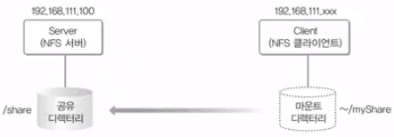

## 이것이 우분투 리눅스다

### 14장 NFS서버 구축

#### NFS서버

- Linux(Unix) 컴퓨터끼리 저장 공간을 공유할 수 있도록 해주는 시스템

|    |서버|클라이언트|
|----|:--:|:----:|
|패키지|nfs-server, rpcbind|nfs-common|
|실행 |$ systemctl restart nfs-server|$ mount -t nfs 192.168.111.100:/share ~/myShare|

#### 실습

##### Server

~~~bash
#### Server ####
# NFS 패키지 설치
apt-get  -y  install nfs-common  nfs-kernel-server  rpcbind

# 공유 디렉토리 생성
mkdir  /share

# NFS 설정
vi  /etc/exports
... 맨밑
+ /share 192.168.111.*(rw, sync)
:wq

# 서버 시작
systemctl  restart  nfs-server
systemctl  enable  nfs-server

# 방화벽 비활성화
ufw  disable

#### Client ####
# NFS 클라이언트 관련 패키지 설치
apt-get  -y  install  nfs-common

# 서버에서 마운트되고 있는 폴더 확인
showmount  -e  192.168.111.100

# 디렉토리 생성 및 마운트
mkdir  ~/myShare
sudo  mount  -t  nfs  192.168.111.100:/share  ~/myShare

# fstab 등록
sudo  gedit  /etc/fstab
... 맨밑에
+ 192.168.111.100:/share  /home/ubuntu/myShare  nfs  defaults  0  0
:wq

reboot
~~~