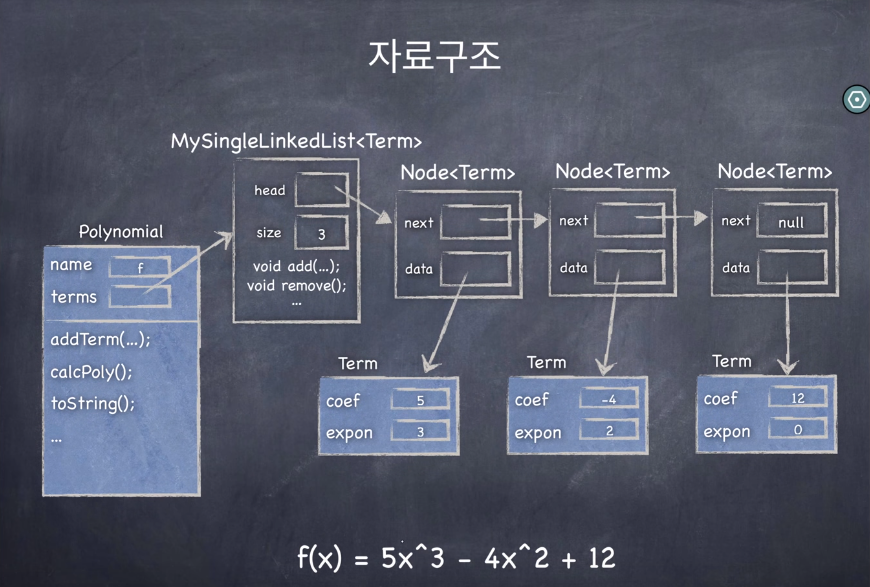

[[toc]]

## 자료구조 - JAVA

### 다항식 프로그램 - 연결리스트 응용

- "항" 클래스 
  - 계수 : coef
  - 차수 : expo
- 각 노드는 "항" 데이터를 가진다.
- 각 데이터는 차수에 따라 내림차순으로 정렬된다.

#### 각 클래스 구조

항 : Term
- 속성
  - 계수 - coef : int
  - 차수 - expo : int
- 메소드
  - calc : int
    - 특정 x값이 들어갔을 때 해당 항의 결과값 리턴

~~~java
public class Term {
	
	public int coef;
	public int expo;
	
	public Term(int c, int e) {
		this.coef = c;
		this.expo = e;
	}
	
	public int calc(int x) {
		return coef * (int)Math.pow(x, expo);
	}
}
~~~

 

다항식 : Polynomial
- 속성
  - 다항식 이름 - name : char
  - 다항식 - terms : MySingleLinkedList
- 메소드
  - addTerm : void
    - 새로운 항 추가
      - 추가하려는 항과 동일 차수의 항이 이미 있는 경우 : 기존 항의 계수와 새로운 항의 계수 계산
      - 그렇지 않은 경우: 새로운 항 삽입(항들은 차수의 내림차순으로 항상 정렬)
  - calc : int
    - 특정값을 x에 대입했을 때 결과값
  - toString : String

> 삽입과정
> - 삽입하려는 항의 차수보다 작은 차수가 나오면 해당 작은 차수 앞에 넣어준다!
> - 하지만 **항을 삽입하려면 이전 노드를 알아야한다!**(노드에 대한 참조변수가 2개 필요(prev, next))

~~~java
public class Polynomial {
	
	public char name;
	public MySingleLinkedList<Term> terms;
	
	public Polynomial(char name) {
		this.name = name;
		this.terms = new MySingleLinkedList<Term>();
	}
	
	public void addTerm(int coef, int expo) {
		if(coef == 0)
			return;
		Node<Term> p = terms.head;      // 현재 탐색 노드
		Node<Term> q = null;            // 이전 탐색 노드
		while(p != null && p.data.expo > expo) {        // 삽입할 항의 차수가 같아지거나 작을 때까지 탐색(Traversing)
			q = p;
			p = p.next;
		}
		if(p != null && p.data.expo == expo) {	// 삽입할 항의 차수와 같은 차수가 다항식에 있는 경우
			p.data.coef += coef;
			if(p.data.coef == 0) {  // 계수끼리 계산한 것이 0일 경우 노드를 없애야한다.
				// 항의 계수가 0일 경우 삭제
				if(q == null)	// 첫번째 항일 경우
					terms.removeFirst();
				else
					terms.removeAfter(q);
			}
		} else {		// 새로운 항을 q뒤에 삽입
			Term t = new Term(coef, expo);
			if(q == null)	// 추가될 항이 첫번째 항일 경우
				terms.addFirst(t);
			else			
				terms.addAfter(q, t);
		}
	}
	
	public int calc(int x) {
		int result = 0;
		
		Node<Term> p = terms.head;
		while(p != null) {
			result += p.data.calc(x);
			p = p.next;
		}
		return result;
	}
	
	public String toString() {
		StringBuilder result = new StringBuilder();
		Node<Term> p = terms.head;
		while(p != null) {
			result
				.append("+")
				.append(p.data.coef)
				.append("x^")
				.append(p.data.expo);
			p = p.next;
		}
		return result.toString();
	}
	
}
~~~

 

다항식 프로그램 : MyPolynomialApp
- 속성
  - 다항식 데이터를 넣을 배열 - polys : Polynomial[]
  - 다항식 배열의 크기 - n : int
  - 콘솔의 입력값을 받는 객체 - kb : Scanner
- 메소드
  - processCommand : void
    - 키보드 입력값을 처리할 메소드
  - handlePrint : void
    - 입력받은 이름의 다항식을 찾아 출력
  - handleCalc : void
    - 입력받은 x값을 대입하여 계산된 결과값 출력
  - handleAdd : void
    - 해당 이름의 다항식에 추가
  - handleCreate : void
    - 다항식을 추가
  - find : int
    - 해당 이름의 다항식을 배열에서 찾아 인덱스 리턴

~~~java
public class MyPolynomialApp {
	
	// 여러개의 다항식을 보관할 데이터
	private Polynomial [] polys = new Polynomial[100];
	int n = 0;
	private Scanner kb = new Scanner(System.in);
	
	public MyPolynomialApp() {
		
	}
	
	public void processCommand() {	// 키보드 입력을 처리할 메소드
		
		while(true) {
			System.out.print("$ ");
			String command = kb.next();
			if (command.equals("create"))
				handleCreate();
			else if (command.equals("add"))
				handleAdd();
			else if (command.equals("calc"))
				handleCalc();
			else if (command.equals("print"))
				handlePrint();
			else if (command.equals("exit"))
				break;
		}
		kb.close();
	}
	
	private void handlePrint() {
		char name = kb.next().charAt(0);
		int index = find(name);
		if(index < 0) {
			System.out.println("No such polynomial.");
			return;
		}
		System.out.println(polys[index].toString());
	}
	
	private void handleCalc() {
		char name = kb.next().charAt(0);
		int x = kb.nextInt();
		int index = find(name);
		if(index < 0) {
			System.out.println("No such polynomial.");
			return;
		}
		System.out.println(polys[index].calc(x));
	}
	
	private void handleAdd() {
		char name = kb.next().charAt(0);
		int coef = kb.nextInt();
		int expo = kb.nextInt();
		int index = find(name);
		if(index < 0) {
			System.out.println("No such polynomial.");
			return;
		}
		polys[index].addTerm(coef, expo); 		// 찾은 다항식에 항 추가
	}
	
	private int find(char name) {
		// TODO Auto-generated method stub
		for(int i = 0 ; i < n ; i++) {
			if(polys[i].name == name)
				return i;
		}
		return -1;
	}

	private void handleCreate() {
		char name = kb.next().charAt(0);	// next메소드는 문자열로 입력받는다.
		Polynomial p = new Polynomial(name);
		
		polys[n++] = p;
	}
	
	public static void main(String[] args) {
		MyPolynomialApp app = new MyPolynomialApp();
		app.processCommand();
	}

}
~~~
