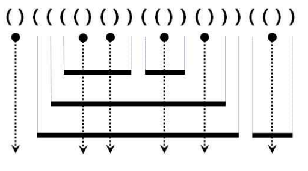

[[toc]]

## Programmers - 코딩테스트 연습

### 스택/큐 응용 - 쇠막대기

[프로그래머스 링크](https://programmers.co.kr/learn/courses/30/lessons/42585)

 

#### 예제 그림

 

#### 문제 설명

- 쇠막대기는 자신보다 긴 쇠막대기 위에만 놓일 수 있습니다.
- 쇠막대기를 다른 쇠막대기 위에 놓는 경우 완전히 포함되도록 놓되, 끝점은 겹치지 않도록 놓습니다.
- 각 쇠막대기를 자르는 레이저는 적어도 하나 존재합니다.
- 레이저는 어떤 쇠막대기의 양 끝점과도 겹치지 않습니다.

(a) 레이저는 여는 괄호와 닫는 괄호의 인접한 쌍 '()'으로 표현합니다. 또한 모든 '()'는 반드시 레이저를 표현합니다.

(b) 쇠막대기의 왼쪽 끝은 여는 괄호 '('로, 오른쪽 끝은 닫힌 괄호 ')'로 표현됩니다.

 

#### 입출력 예

|arrangement|return|
|-----------|------|
|"()(((()())(())()))(())"|17|

 

#### 내 풀이

문제 설명이 더 혼동을 주는 것 같아서 **그림만 보고**! 문제를 이해하고 풀이를 해야겠다고 생각함.

**내가 생각한 문제의 이해**

- 일단 입력값은 '('와 ')' 밖에는 없다.
- '()'이면 레이저가 생겨 쇠막대기를 자를 것이다.
- '(' 2개 이상부터 쇠막대기는 1개씩 증가한다.
- 앞에와는 반대로 ')' 2개 이상부터 쇠막대기는 1개씩 감소한다.

**문제 해결 접근**

- 입력된 문자열을 쪼개고 순회하여 문자들을 체크
- **'('는 막대기 수 증가, ')'는 막대기 수 감소**
- 레이저가 생성되면 생성된 막대기만큼 잘릴 막대기가 증가
  - 2개의 막대기 생성된 뒤 레이저가 나올 때 잘리는 막대기는 2개(잘린 뒤의 남는 막대기는 나중에 처리)
- 순회할 때 **이전 문자와 현재 문자가 계속 비교**되어야 함.
  - 스택이용 : Top과 Input을 계속 비교
- ')'가 2개 이상이 되면 쇠막대기가 감소, 이때 잘리는 것이 끝나는 막대기이므로 잘린 막대기 갯수에 +1을 해야한다.(한 막대기에 2개의 레이저를 쏘면 3개로 쪼개짐)
- '('가 나오면 생성된 막대기 변수를 증가시키되 2개 이상부터 막대기가 생기므로 ')'가 나왔을 때 생성된 막대기 변수를 감소시킨 후 **잘린 막대기 갯수 += 생성된 막대기 갯수**를 수행한다.

글로만 봐서는 이해하기 힘들어 표로 정리

**Top과 Input을 비교, 결과값을 예측해보는 표 작성**

- 스택에는 값을 무조건 push!

|TOP|INPUT|결과|
|:-:|:---:|:--|
|NULL|'(' |막대기수 +1|
|NULL|')' |x(나오면 error)|
|'('|'(' |막대기수 +1|
|'('|')' |막대기수 -1 -> 결과값 += 막대기수(레이저)|
|')'|'(' |막대기수 +1|
|')'|')' |막대기수 -1 -> 결과값 +1|

 

#### 소스 코드

~~~java
import java.util.Stack;

/*
    맨처음 문자가 ')'이 들어가는 입력값은 예외처리 하지 않음.
*/

public class StealBar_algorithm {
	
	private static int solution(String arrangement) {
		int answer = 0;     // 잘린 막대기 갯수(결과값)
		int add_stealbar = 0;   // 생성된 막대기
		Stack<Character> stack = new Stack<>();
		
		for(char input : arrangement.toCharArray()) {
			if(stack.isEmpty()) {   // TOP: NULL, Input: '('
				stack.push(input);
				add_stealbar++;
			} else {
				char top = stack.peek();
				if(input == '(') {  // top의 값과 상관없이 input이 '('면 막대기 추가
					stack.push(input);
					add_stealbar++;
				} else {
					if(top == '(') {  // 레이저
						stack.push(input);
						add_stealbar--;
						answer += add_stealbar;
					} else {    // 막대기 감소
						stack.push(input);
						add_stealbar--;
						answer++;
					}
				}
			}
		}
		
        return answer;
    }

	public static void main(String[] args) {
		// TODO Auto-generated method stub
		int n = solution("()(((()())(())()))(())");
		System.out.println("Answer : " + n);
	}

}

-> Answer : 17
~~~

 
 

### 스택/큐 응용 - 프린터 우선순위

[프로그래머스 링크](https://programmers.co.kr/learn/courses/30/lessons/42587)

#### 문제설명

1. 인쇄 대기목록의 가장 앞에 있는 문서(J)를 대기목록에서 꺼냅니다.
2. 나머지 인쇄 대기목록에서 J보다 중요도가 높은 문서가 한 개라도 존재하면 J를 대기목록의 가장 마지막에 넣습니다.
3. 그렇지 않으면 J를 인쇄합니다.

예를 들어, 4개의 문서(A, B, C, D)가 순서대로 인쇄 대기목록에 있고 중요도가 2 1 3 2 라면 C D A B 순으로 인쇄하게 됩니다.

내가 인쇄를 요청한 문서가 몇 번째로 인쇄되는지 알고 싶습니다. 위의 예에서 C는 1번째로, A는 3번째로 인쇄됩니다.

 

#### 입출력 예

|priorities|location|return|
|----------|--------|------|
|[2, 1, 3, 2]|2|1|
|[1, 1, 9, 1, 1, 1]|0|5|

 

#### 내 풀이

**문제 이해**

- 맨 앞의 데이터가 제일 높은 우선순위이면 프린트
- 제일 높지 않으면 대기목록에서 가장 뒤로

**문제 해결 접근**

- 일단 맨 앞의 데이터와 전체 데이터를 비교하는 로직이 필요
  - 맨 앞의 데이터가 제일 높은 우선순위이면 프린트
    - **실제 인쇄 순서를 저장할 변수(List) 필요**
  - 제일 높지 않으면 대기목록에서 가장 뒤로 
    - 앞의 데이터를 꺼내 비교하고, 뒤로 다시 데이터를 넣는 방식 필요
      - **입력된 대기목록을 Queue로 이용!**
- 입력값을 보면 대기목록으로 배열, 인쇄 요청한 문서의 위치는 index로 주어진다.
  - Queue를 통해 데이터를 비교하며 실제 인쇄 순서로 다시 배열을 만든다면 **실제 인쇄순서를 다 만들었을 때 이전 대기 목록의 location(index)을 가지는 값을 찾을 수 없다.**
  - location값까지 저장할 객체 정의가 필요
    - location(이전 인쇄 대기 목록에서의 위치)
    - priority(인쇄 우선순위 값)

|조건|결과|
|:-:|:-:|
|앞에 있는 인쇄의 우선순위 >= 제외한 각각의 우선순위|실제 인쇄목록에 추가|
|앞에 있는 인쇄의 우선순위 < 제외한 각각의 우선순위|대기목록(Queue) 뒤로 삽입|

 

#### 소스코드

~~~java
import java.util.ArrayList;
import java.util.List;
import java.util.Queue;
import java.util.concurrent.ArrayBlockingQueue;     // 구현 클래스는 아무거나 사용함.

public class Print_precedure_algorithm {
	
	private static int solution(int[] priorities, int location) {
		int answer = 0;
		
		List<PrintQueue> arrange_list = new ArrayList<>();  // 실제 인쇄 순서
		Queue<PrintQueue> queue = new ArrayBlockingQueue<>(priorities.length);  // 대기목록 큐
		
		for(int i = 0 ; i < priorities.length ; i++) {
			queue.add(new PrintQueue(i, priorities[i]));    // 배열을 맵핑하여 큐에 저장
		}
		
		while(!queue.isEmpty()) {   // Queue에 데이터가 없을 때까지
			PrintQueue temp = queue.remove();
			
			if(queue.stream().anyMatch(pq -> pq.priority > temp.priority)) {    // Queue순회했을 때 더 높은 우선순위가 나오면
				queue.add(temp);
			} else {
				arrange_list.add(temp); //
			}
		}
		
		for(PrintQueue pq : arrange_list) {
			if(pq.location == location) {
				answer = arrange_list.indexOf(pq);
                break;
			}
		}
		
		return answer + 1;  // 순위는 1부터 시작
	}

	public static void main(String[] args) {
		// TODO Auto-generated method stu
		int[] pr1 = {2,1,3,2};
		int[] pr2 = {1, 1, 9, 1, 1, 1};
		int result1 = solution(pr1, 2);
		int result2 = solution(pr2, 0);
		
		System.out.println(result1);
		System.out.println(result2);
	}

}

class PrintQueue {      // 네이밍을 잘못한 것 같지만 걍 ㄱ
	public int location;
	public int priority;
	public PrintQueue(int location, int priority) {
		this.location = location;
		this.priority = priority;
	}
}

->
1
5
~~~