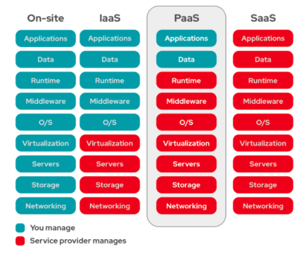

[[toc]]

## 클라우드 플랫폼

인터넷을 통해서 특정 기업이 사용자에게 제공하는 인프라(Iaas), 플랫폼(PaaS), 소프트웨어(SaaS)이다.

### 인터넷을 통해서 인프라를 제공하는 IaaS(Infrastructure-as-a-Service)

- 사용자에게 스토리지, 네트워킹, 서버 등의 컴퓨팅 자원을 이용할 수 있도록 제공하는 클라우드 컴퓨팅 오퍼링
- 하드웨어를 구매해야되는 온프레미스 방식 대신 대규모의 컴퓨팅자원을 가진 업체에게 제공받는 것.
- 사용자는 자체 하드웨어를 구매하고 유지보수하는 데에 비용을 절감할 수 있음.

### 인터넷을 통해서 플랫폼을 제공하는 Paas(Platform-as-a-Service)

- IaaS 에서 확장된 형태로 어플리케이션의 개발, 실행, 관리를 위한 플랫폼을 제공하는 서비스
- 운영체제 소프트웨어, 데이터베이스, 스토리지, 개발툴 등 모두를 호스팅한다.
- 사용한 리소스에 대해서만 비용을 지불한다.
- 어플리케이션의 빌드, 테스트, 배포를 편리하게 제공받기 때문에 서비스 비즈니스에 더욱 집중할 수 있게한다.
- 시장출시 시간단축, 다양한 리소스에 대한 저렴한 액세스, 위험은 줄이고 자유롭게 체험, 간편하고 비용 효율적, 개발팀의 유연성향상, 전체비용 절감

### 인터넷을 통해서 소프트웨어를 제공하는 Saas(Software-as-a-Service)

- 애플리케이션 자체를 인터넷을 통해 제공받는 형태
- 소비자 대상의 서비스, 인사관리 소프트웨어, 콘테츠 관리 시스템, 고객 관계 관리툴, IDE 등이 있다.
- 사용자는 컴퓨터 또는 모바일 기기의 웹브라우저를 통해 소프트웨어와 상호작용합니다.
- 주로 구독모델을 통해 소프트웨어 라이센스를 제공합니다.
