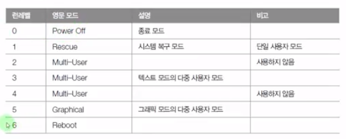
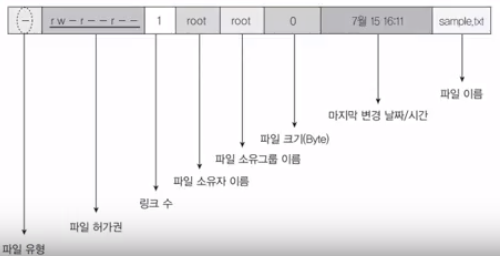
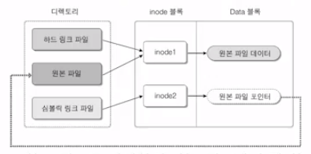

[[toc]]

## 이것이 우분투 리눅스다

[유튜브 링크](https://www.youtube.com/playlist?list=PLVsNizTWUw7H0hL3MIk4POxadZVwNOycL)

4장 8교시 - 네트워크 개념과 관련 파일 까지

 

### 4장 필수 개념과 명령어

#### 시작과 종료

- 종료

~~~
// 터미널, 콘솔을 통한 종료
    # poweroff
    # shutdown -P now
    # halt -p
    # init 0
~~~

- 재부팅

~~~
// 터미널, 콘솔을 통한 종료
    # shutdown -r now
    # reboot
    # init 6
~~~

- 로그아웃 - 보통의 리눅스 서버는 끄지 않고 로그아웃 하는 것이 일반적

~~~
// 터미널, 콘솔
    # logout
    # exit
~~~

#### 가상 콘솔

- 가상의 모니터라고도 불림
- ctrl + alt + F1~F7 (F7은 X윈도우 모드)

 

##### 실습

~~~
- F1, F2 콘솔을 만듬
- F1 콘솔에 5분후 컴퓨터 종료시키는 명령 실행
    # shutdown -h 5
- F2 콘솔에 해당 명령에 대한 알림 출력 확인
~~~

#### 런레벨 (Run level)

- init 명령 뒤에 붙는 숫자를 런레벨

해당 부팅의 런레벨을 확인 - /lib/systemd/system/default.target

해당 링크가 어떠한 런레벨모드를 가리키는지 확인

##### 실습 - 기본 런레벨 체인지

~~~
// 기본 런레벨 확인
# ls -l /lib/systemd/system/default.target
// Multi-User 모드로 변경
# ln -sf /lib/systemd/system/multi-user.target /lib/systemd/system/default.target
-> 재부팅 시 텍스트모드(Multi-User)로 부팅되는 것을 확인 가능
~~~

#### vi

##### 실습 - 비정상 종료시 조치

~~~
// 편집작업 준비
# vi new.txt
... 비정상 종료를 위해 편집도중 터미널 끄기
// 다시 편집작업 준비
# vi new.txt
... 에러
# ls 
... .new.txt.swp 스왑파일이 생성된 것을 볼 수 있다.
// .new.txt.swp 삭제
# rm -rf .new.txt.swp
~~~

#### CD/DVD 마운트

- mount 명령 : 현재 연결된 장치들을 출력
- umount 명령 : 장치 연결해제

##### 실습

~~~
// 부팅 전 가상머신 세팅에 CD/DVD에서 iso -> physical 설정 변경
// 필자는 미리 iso세팅하고 부팅을 하니까 장치 인식에 문제가 생겼음.
...

// 부팅 완료시 iso설정 세팅
... 자동으로 iso파일을 마운트

// cd가 들어간 것 확인
# mount
# ls -l /dev/cdrom

// 연결해제
# umount /dev/cdrom 
    * warning : 터미널 현재 경로가 CD관련 디렉토리 안에 있을 경우 명령 수행 못함
~~~

#### 사용자 및 그룹관리

- /etc/passwd : 리눅스 사용자 정의
- /etc/group : 그룹 정의
- /etc/shadow : 숨겨진 비밀번호

##### 실습 - 사용자 생성

~~~
생성 순서 : 그룹 생성 -> 사용자 생성 (보통 이렇다 함)

// 그룹 생성
# groupadd ubuntuGroup
// 그룹 생성 확인
# tail -5 /etc/group
...
// 사용자 생성 : 그룹ID 1001, user1 추가
# useradd --gid 1001 user1
... 비밀번호 생성

// * 유저 생성시 홈디렉토리에 자동으로 넣어줄 파일들 설정
# ls -a /etc/skel
... 해당 디렉토리 안의 파일 및 디렉토리를 유저 생성시 홈디렉토리에 복사
~~~

#### 4장 5교시 - 파일의 소유권 및 허가권

파일유형

d : 디렉토리, - : 일반 파일

파일허가권

(---)(---)(---) : 3구간을 나누어 차례대로 소유자, 그룹, 그 외 사용자 순 -에 다음의 영어문자로 권한을 구분한다.

r : 읽기권한, w : 쓰기권한, x : 실행권한

- 허가권 변경 : chmod 755 sample.txt

파일소유권

- 소유권 변경 : chown 소유권 변경, chgrp 그룹 소유권 변경

링크

- 하드링크 : 원본파일과 같은 inode를 사용
- 심볼릭링크 : 새로운 inode를 만들고 데이터는 원본파일을 연결

##### 실습

~~~
// 하드링크
# ln basefile hardlink
// 심볼릭 링크
# ln -s basefile softlink

// * 원본파일(basefile) 삭제 시 차이점
// 원본파일 삭제
# rm -f basefile
// 하드링크 실행
# cat hardlink
... 정상
// 심볼릭링크 실행
# cat softlink
... 파일이 없습니다.
-- 심볼릭은 원본파일을 연결하는 포인터가 데이터로 있어 원본파일이 없어진 지금 상태에선 실제 데이터를 읽을 수 없다.
~~~

...6교시 7교시 건너뜀

#### 4장 8교시 네트워크 기본 설정

##### 실습

~~~
// 주소 설정 확인 및 변경
# nm-connection-editor : GUI로 네트워크 설정 
# cat /etc/NetworkManager/system-connections/유선\ 연결\ 1
...
[ipv4]
여기서 주소 설정을 바꿀 수 있다.
...

// DNS서버 설정
# vi /etc/resolv.conf
...
nameserver 127.0.1.1 : 기본으로 있는 가상 라우터의 DNS서버
** KT의 DNS서버 - 168.126.63.1

// 인터넷 연결이 안될때 DNS서버 문제인지 판가름
# vi /etc/resolv.conf
...
nameserver 100.100.100.100 : 이상한 DNS서버 지정
# nslookup : 네임서버 테스트
// 해당 도메인을 DNS서버가 ip로 바꿀 수 있는지 테스트
> www.hanbit.co.kr 
;; connection timed out; no servers could be reached : 인터넷 연결 안됨
// 거의 모든 도메인을 ip로 변환해주는 KT DNS서버로 지정
> server 168.126.63.1
// 다시 테스트
> www.hanbit.co.kr
Name: www.hanbit.co.kr
Address: ip.ip.ip.ip
~~~

##### 텍스트모드(서버(B))에서는...

~~~
# cat /etc/network/interfaces
...
iface ens32 ...
주소 및 DNS까지 설정
-> 해당 설정에 따라 /etc/resolv.conf에 반영됨

# cat /etc/resolv.conf
... 위의 DNS서버 설정과 동일
~~~

