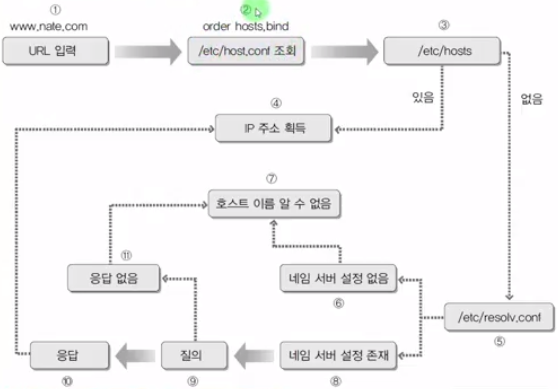
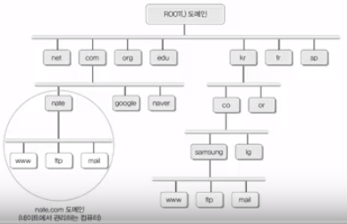
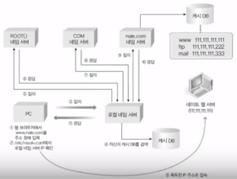
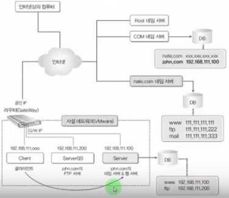

[[toc]]

## 2018년 10월 7일

어제가 제대한지 3년~ 어렴풋이 계속 기억하는거 오마이갓

내년 예비군만하면 끝

## 이것이 우분투 리눅스다

### 7장 1~2교시 : 쉘스크립트

- C언어와 유사하게 프로그래밍 가능
- 변수, 반복문, 제어문
- 별도 컴파일X, 텍스트 파일 형태로 바로 실행
- 실행방법
  - "sh <스크립트 파일>"로 실행
  - "chmod +x <스크립트 파일>"명령으로 실행가능 속성으로 변경 후, "./<스크립트 파일>"명령으로 실행

##### 변수
- 다른점
  - 모든 변수를 문자열 취급
    - 연산을 하려면 역따옴표와 expr사용
    - num3=\`expr 100 + 200\`
  - 변수 대입시 "=" 양쪽에 공백이 없어야함.
  - "$변수이름"으로 값을 불러옴
  - 파라미터 변수
    - $0, $1 ... 의 형태
      - ex) rm -rf file
        - $0=rm
        - $1=-rf
        - $2=file
        - $*=rm -rf file

##### 조건문

~~~bash
if [ 조건 ]     // 단어마다 공백이 있어야한다.
then
    참일 경우 실행
else
    거짓일 경우 실행
fi
~~~

파일과 관련된 조건

|파일 조건|결과|
|:-------:|:------|
|-d 파일이름|파일이 디렉터리면 참|
|-e 파일이름|파일이 존재하면 참|
|-f 파일이름|파일이 일반파일이면 참|
|-g 파일이름|파일에 set-group-id가 설정되면 참|
|-r 파일이름|파일이 읽기가능이면 참|
|-s 파일이름|파일 크기가 0이 아니면 참|
|-u 파일이름|파일에 set-user-id가 설정되면 참|
|-w 파일이름|파일이 쓰기가능이면 참|
|-x 파일이름|파일이 실행가능이면 참|

### 8장 1교시 : 원격접속서버 개념, 텔넷 서버 구축

#### 텔넷서버

- 전통적으로 사용되어온 원격접속
- 보안에 취약
- 접속할 PC에는 텔넷 클라이언트 프로그램으로 접속

#### 실습

~~~bash
# Server
# xinetd, telnetd 설치
apt-get  -y  install  xinetd  telnetd
# xinetd에 telnet 서비스 설정파일 추가
cd /etc/xinetd.d/
ls -l   -> telnet파일 확인
... 없어
touch telnet    -> 파일 생성
vi telnet       -> 파일 수정
service telnet
{
    disalbe = no
    flags = REUSE
    socket_type = stream
    wait = no
    user = root
    server = /usr/sbin/in.telnetd
    log_on_failure += USERID
}
:wq
# 텔넷 접속용 유저생성
adduser teluser      
... 비밀번호 생성 ...
# 텔넷 서버 시작, 재부팅시에도
systemctl restart xinetd    -> 텔넷서버 시작
systemctl enable xinetd     -> 재부팅시에도 시작
# 방화벽에서 텔넷포트(23)허용
ufw  allow  23/tcp          

# 텔넷 접속
ifconfig ens32
...
telnet  192.168.111.100
... 접속성공!

# telnet에서 root계정 접속 불가
# - telnet은 보안이 약해 root계정이 막혀있다.
# - ** 혀용하려면 /etc/securetty 삭제 (권장하지않음)
mv /etc/securetty /etc/securetty.bak
~~~

### 8장 2교시 : SSH서버 구축, VNC서버 구축(VNC 실습안함)

#### OpenSSH

- 텔넷과 용도는 동일
- 보안 강화
- 데이터를 전송할 때 암호화를 한다는 점이 다름

#### 실습

~~~bash
# Server
apt-get  -y  install  openssh-server
systemctl  restart  ssh
systemctl  enable  ssh

# Client(Linux)
# ssh  사용자명@서버IP
ssh  teluser@192.168.111.100
~~~

#### VNC서버

- X윈도우로 접속(그래픽 인터페이스)
- 속도가 매우 느림

### 9장 1교시 : 네임서버 개념과 작동

- 네임서버 = DNS 서버
- 도메인 이름을 IP주소로 변환시켜주는 역할 = 이름 해석
  - www.nate.com -> 120.50.131.112

#### 개요

- 인터넷이 처음으로 쓰일때는 몇대의 컴퓨터밖에 없어 IP주소 자체를 통해 접속

- 컴퓨터가 점점 늘어나며 IP주소로써 기억하기 어려워져 특정파일(hosts)에 URL과 IP주소를 기록함(전화번호부와 유사한 형태)
  - Windows : C:\Windows\system32\drivers\etc\hosts
  - Linux : /etc/hosts
> 102.54.94.57 rhino.acme.com
>
> 38.26.63.10 x.acme.com
- 네트워크 상의 컴퓨터가 기하급수적으로 늘어나고 변동이 심해 모든 IP정보를 파일 하나(/etc/hosts)에 기록하는 것은 무리
- 이름 해석(Name Resolution)을 전문적으로 해주는 서버 컴퓨터의 필요성(=DNS서버 =네임서버)

#### IP주소를 얻는 내부(로컬) 흐름도

- /etc/host.conf -> DNS서비스를 어디서 받는지 정의
- /etc/hosts     -> 도메인 이름과 IP주소 매핑테이블
- /etc/resolv.conf -> 사용될 DNS서버의 IP주소 정의

### 9장 2교시 : 캐싱 전용 네임서버 구축

##### 도메인 이름 체계

초창기 인터넷은 1대의 네임서버만으로 관리가능했지만 폭발적인 확장으로 몇대의 컴퓨터로도 관리할 수 없게 되었다. 트리 구조와 같은 도메인 이름 체계를 고안한다.

##### 로컬 네임서버 작동 순서

##### 캐싱전용 네임서버

- 자기가 관리하는 도메인은 없고 다른 도메인서버를 통해 알아다가 제공한다.

#### 실습

- 기존 DNS서버에서 Server를 캐싱 전용 네임서버로 바꾼다.

~~~bash
# 관련 패키지 설치
apt-get  -y  install  bind9  bind9utils
# 관련 설정파일 수정
vi  /etc/bind/named.conf.options
...
    recursion yes;
    allow-query  {  any;  };
...
:wq
# 서버 구동
systemctl restart bind9
systemctl enable bind9
# 방화벽 포트 허용
ufw  allow  53      // -> tcp/udp 열어줘야
# 테스트
dig 192.168.111.100 www.nate.com

# Server(B), Client에 Server를 네임서버로 지정
vi  /etc/resolv.conf
...
nameserver 192.168.111.100
:wq
~~~

### 9장 3교시 : 마스터 네임 서버

- 도메인에 속해있는 컴퓨터들의 이름을 관리하고, 외부에 해당 컴퓨터의 IP주소를 알려주는 역할

#### 실습

- john.com의 마스터네임서버 설치 및 운영

- Server : 네임 서버 & 웹서버
- Server(B) : FTP 서버

~~~bash
# 웹서버 및 FTP서버 간단 구동
## 웹서버 - Server
apt-get  -y  install  apache2
systemctl  restart  apache2
systemctl  enable  apache2
ufw  allow  80      ->  웹서버는 80번 포트
cd  /var/www/html
rm  index.html
vi  index.html
<h1>Ubuntu Web Server</h1>
:wq
## FTP서버 - Server(B)
apt-get  -y  install  vsftpd
cd  /srv/ftp
vi welcome.msg              -> 클라이언트 ftp연결시 메세지출력
Welcome Ubuntu Server
:wq
vi  /etc/vsftpd.conf
anonymous_enable=YES
banner_file=/srv/ftp/welcome.msg
:wq
systemctl restart vsftpd

################## 마스터 네임서버 구축 ******************
# 도메인에 대한 설정파일 포워딩
vi /etc/bind/named.conf
...
zone  "john.com"  IN  {
    type  master;
    file  "/etc/bind/john.com.db";
};
:wq
# 오류 체크
named-checkconf
# 도메인에 대한 설정파일 추가
cd  /etc/bind
vi john.com.db
$TTL    3H
@       IN  SOA @   root    (2 1D 1H 1W 1H)

@       IN  NS  @   
        IN  A   192.168.111.100     

www     IN  A   192.168.111.100     # 웹서버
ftp     IN  A   192.168.111.200     # ftp서버
:wq
# 오류 체크 
named-checkzone  john.com  john.com.db
systemctl  restart  bind9

# Client(Linux)에서 접속 확인
cat  /etc/resolv.conf       # 네임서버 설정확인
...
# 웹서버 접속 확인
Firefox -> john.com -> www.john.com 접속 성공!
# FTP서버 접속 확인
ftp ftp.john.com
...
220-##################
220-Welcome Ubuntu Server
220-##################
...
ftp>                -> ftp 접속 성공!
~~~

## Vuepress 관련 지식

- \~~~sh라고 붙인 코드들에 highlight가 되자 않음
- 찾다가 highlight.js를 config.js에 붙이는 예제를 vuepress documentation에서 봄
- chainMarkdown속성에 highlight.js를 붙여도 안댐..ㅠ

~~~javascript
// .vuepress/config.js  # 적용이 안되는 코드
var hljs = require('highlight.js');
...
module.exports = {
    ......
	chainMarkdown(config) {
		config.options.highlight = function(str, lang) {
			if (lang && hljs.getLanguage(lang)) {
				try {
					return hljs.highlight(lang, str).value;
				} catch (__) {}
			}

			return ''; // use external default escaping
		};
	}
};
// element에 class라도 바뀌어야되는데 잘못된건가?
~~~

- 근데 다른 언어는 highlight가 되는데 왜 sh은 안되는 거지? 라는 생각이 듬.
- 더 찾아보니 vuepress는 highlight하는 라이브러리로 [prismjs](https://prismjs.com/#languages-list)를 쓰는 것을 알아냄. ([참고](https://github.com/vuejs/vuepress/blob/58261c1ae3d101c2e512202b3b1edfacc10a645d/lib/markdown/highlight.js))
- prismjs에서 Supported languages 확인했는데 sh은 없고 bash가 있음.
- sh -> bash로 바꾸니 됨. 삽질 헿
- md파일에서 highlight가 잘 안될때 [prismjs](https://prismjs.com/#languages-list) 참고