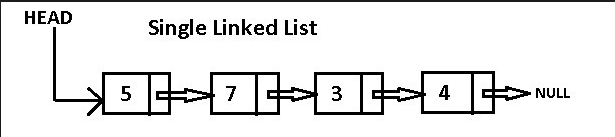

[[toc]]

## 자료구조 - JAVA

### 연결리스트

리스트
- 순서를 가지는 데이터의 집합
- 기본적 연산 : 삽입, 삭제, 검색

배열의 단점
- 크기가 고정 - reallication(재할당)이 필요
- 리스트의 중간에 원소를 삽입하거나 삭제할 경우 다수의 데이터를 옮겨야 한다.
  - 비용, 시간이 많이 든다.

연결리스트
- 다른 데이터의 이동없이 중간에 삽입이나 삭제가 가능하며, 길이의 제한이 없다.
- 랜덤 액세스 불가능
  - 배열에 접근하려면 첫번째부터 순서대로 접근해야 한다.

 

각 노드는 **데이터필드**와 하나 이상의 **링크필드**로 구성된다.

링크 필드는 다음 노드를 참조, 첫번째 노드는 HEAD로 따로 저장

#### Single LinkedList 구현

##### Node 클래스 구현

- 데이터필드와 링크 필드로 나뉨
- 링크 필드 값이 NULL이면 해당 노드가 마지막 노드

~~~java
// Node.java

public class Node<T> {
	public T data;          // 데이터 필드
	public Node<T> next;    // 링크 필드
	
	public Node(T data) {   // 노드 생성시 데이터 저장
		this.data = data;
		this.next = null;
	}
}
~~~

##### Single LinkedList

- 리스트의 시작 <- head
- 리스트의 크기
  - 크기를 변수에 저장하지 않을 시 사이즈를 구할 때마다 리스트를 순회하며 사이즈를 얻어야해 비용이 많이 든다.

~~~java
// MySingleLinkedList.java

class MySingleLinkedList<T> {
	
	// 첫번째 노드의 주소
	public Node<T> head;
	public int size;	// 리스트 크기
	
	public MySingleLinkedList() {
		this.head = null;
		this.size = 0;
	}
	
	public void addFirst(T item) {
		
		Node<T> newNode = new Node<T>(item);	// 1) 새로운 노드를 만들고, 추가할 데이터를 저장한다.
		newNode.next = head;					// 2) 새로운 노드의 next필드가 현재의 head노드를 가리킨다.
		this.head = newNode;					// 3) 새로운 노드를 새로운 head로 한다.
		this.size++;							// 노드가 추가되었으므로, 리스트 사이즈 증가.
		
	}
	
	public void addAfter(Node<T> before, T item) {

		Node<T> temp = new Node<T>(item);	// 1) 새로운 노드를 만들고 데이터를 저장한다.
		temp.next = before.next;			// 2) 새로운 노드의 next필드가 before의 다음 노드를 가리킨다.
		before.next = temp;					// 3) 새로운 노드를 before의 다음 노드로 만든다.
		this.size++;
		
	}
	
	public T removeFirst() {
		/*
		 * head가 null이 아니라면 head가 현재 노드의 다음 노드를 가리킨다.
		 * */
		if(head == null) 
			return null;
		T temp = head.data;
		head = head.next;
		this.size--;
		return temp;
	}
	
	public T removeAfter(Node<T> before) {
		Node<T> temp = before.next;
		if(temp == null)
			return null;
		before.next = temp.next;
		this.size--;
		return temp.data;
	}
	
	public int indexOf(T item) {	// 검색 Traversing a Linked List
		Node<T> p = this.head;
		int index = 0;
		while(p != null) {
			if(p.data.equals(item))
				return index;
			p = p.next;
			index++;
		}
		return -1;
	}
	
	public T get(int index) {
		if(index < 0 || index >= size) {
			return null;
		}
		Node<T> p = head;
		for(int i = 0 ; i < index; i++)
			p = p.next;
		return p.data;
	}
	
}
~~~